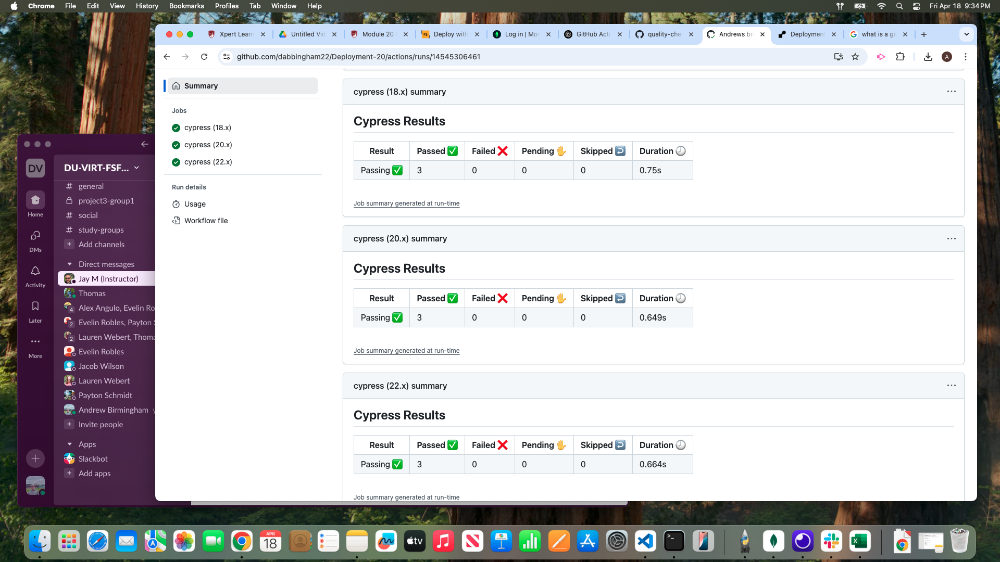
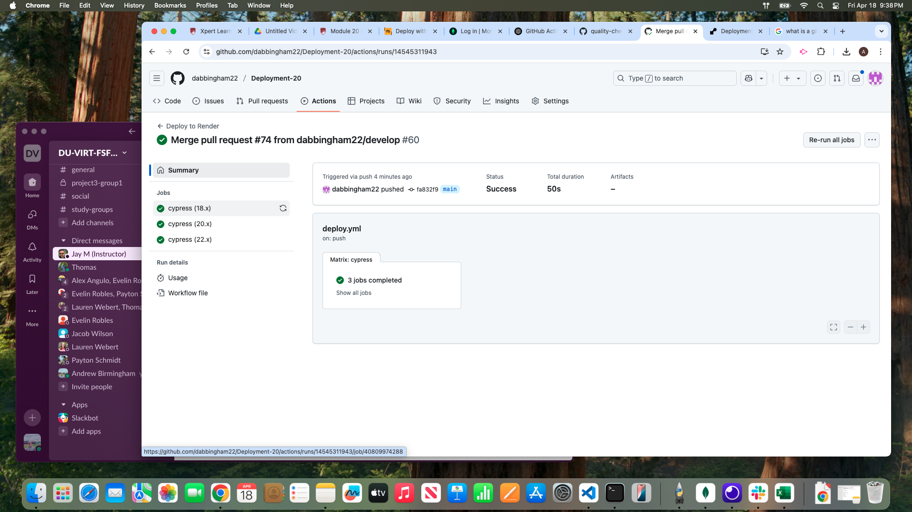

# Deployment-20

## Description 

This project focuses on Continuous Integration and Continuous Deployment. This is done using GitHub Actions that run component tests using cypress to determine if the code still works correctly after the deploying new code. These GitHub Actions can be triggered based of rulesets put in place in GitHub

## Screenshot

## Link

Render - https://deployment-20.onrender.com

GitHub - https://github.com/dabbingham22/Deployment-20